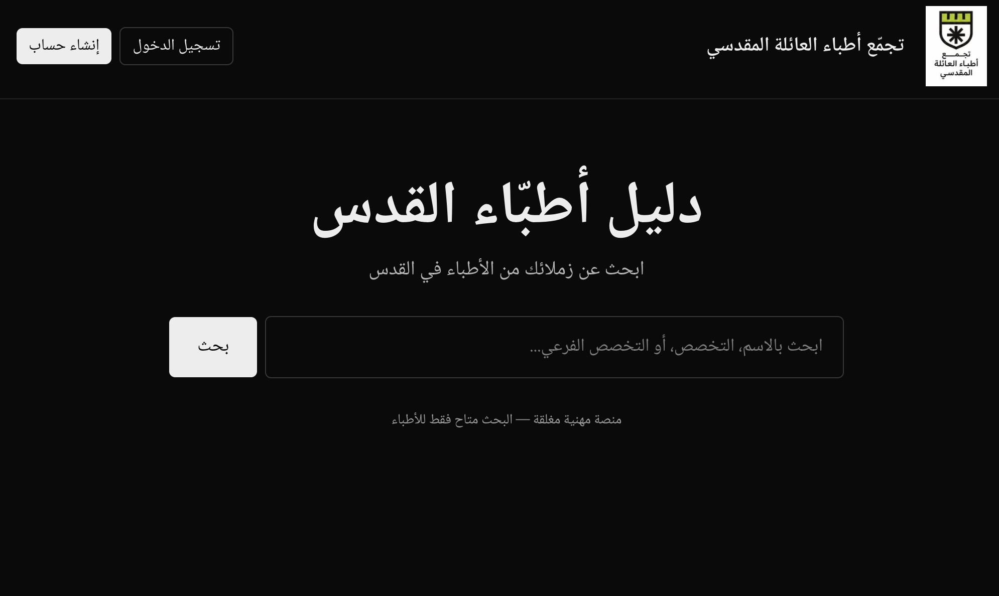
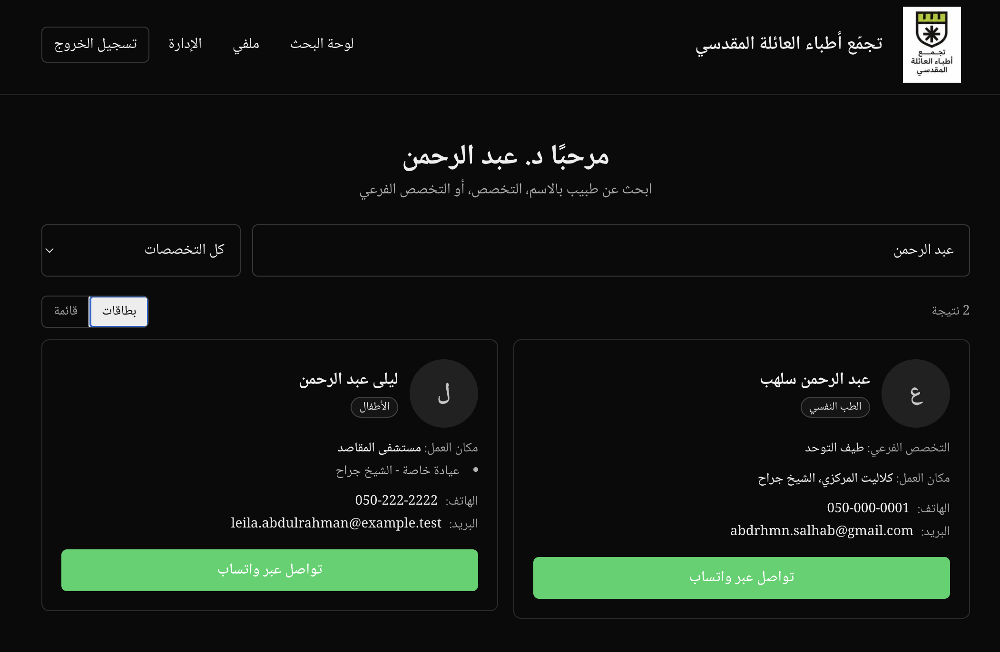

# Jerusalem Doctors Directory

### دليل أطبّاء القدس · تجمّع أطبّاء العائلة المقدسي

*A closed, Arabic-first professional directory that helps verified doctors in Jerusalem find each other and connect over WhatsApp. Built voluntarily for the Jerusalemite medical community.*

🌐 Live: [jerusalem-doctors.vercel.app](https://jerusalem-doctors.vercel.app)

---

## The problem

Jerusalem's Palestinian doctors are scattered across hospitals, clinics, and private practices — Hadassah, Al-Maqassed, Augusta Victoria, Saint Joseph, Shaare Zedek, and dozens of smaller clinics. There has never been a single trustworthy way for them to find each other and refer patients across specialties.

Existing options are either public (and ignore the privacy
expectations of practising physicians), informal (WhatsApp groups that age poorly), or simply don't exist for the Arabic-speaking medical community.

This directory closes that gap. It's a **closed, identity-verified, Arabic-first** network. Only registered, license-checked doctors can sign in, search, or be searched.

---

## Screenshots

---

## What it does

- **Closed signup with real-license verification.** Every signup is
  cross-checked against the official Israel Ministry of Health doctors
  registry (published as an open dataset on data.gov.il). License number + Hebrew name must match before an OTP is even sent. Mismatches go to a manual admin queue — no fake doctors get in.
- **Arabic-first UI**, RTL throughout. Hebrew name fields are stored but the interface stays Arabic.
- **Phone-OTP authentication** — passwordless, no credentials to leak.
- **Smart Arabic search.** A custom normalization layer treats أحمد / احمد / إحمد / آحمد as the same name. Searches doctors by name, subspecialty, specialty, *and* workplace, all in one box.
- **Two view modes** — visual cards for browsing, compact rows for scanning.
- **WhatsApp click-to-chat** straight from any doctor card. Per-doctor
- **Privacy posture** — Row-Level Security on every table holding personal data; service-role keys never reach the browser; daily MoH mirror runs server-side under a cron secret.

## Built with

| Layer | Tools |
|---|---|
| Framework | **Next.js 16**, React 19, TypeScript |
| Styling | **Tailwind 4**, RTL-aware, Noto Naskh Arabic font |
| Database & auth | **Supabase** (Postgres), Row Level Security, Phone Auth, Storage |
| Validation | **Zod** end-to-end |
| External data | **CKAN API** for daily MoH practitioners sync |
| Rate limiting | **Upstash Redis** sliding window |
| Bot protection | **Cloudflare Turnstile** |
| Hashing | **bcryptjs** for OTP hash storage |
| Testing | **Vitest** |
| Hosting | **Vercel** |

## A few engineering details I'm proud of

- **Single-source Arabic normalization.** A pure JS function handles hamza variants, alef-maksura, tatweel, and diacritics — and the same rules are baked into the seed migration so the DB and the search query agree to the byte. Test corpus: 18 Arabic edge cases.
- **MoH license matching.** Three-tier match: exact, soft (Levenshtein ≤ 1 or substring, for spelling variants like דוד / דויד), or not-found. Soft matches and not-founds land in admin queue rather than silently auto-approving.
- **Mirrored 56k-row MoH dataset.** Daily cron deduplicates doctors with multiple specialty certificates (the public dataset has one row per certificate, not per doctor) and upserts in batches of 500 to avoid Postgres' "ON CONFLICT cannot affect a row twice" trap.
- **Mobile-first responsive shell.** Tested on real Android/iOS phones, RTL preserved, big tap targets.

## About the developer

Built and maintained voluntarily by **Abdelrahman Salhab** — designed, implemented, deployed, and operated solo. Available for software engineering work and meaningful collaborations.

- 💼 [LinkedIn](https://www.linkedin.com/in/abdelrahman-salhab/)
- 💬 [WhatsApp](https://wa.me/972524209156)

If this project helps someone you know, or if you'd like a similar tool for
your community, get in touch.

---
> Code published openly so other community-tech projects can borrow patterns (Arabic search, registry cross-checks).